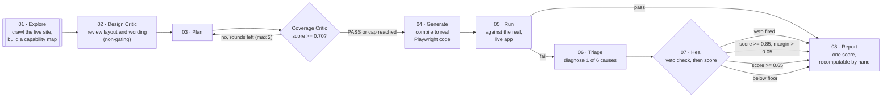

# FORGE

**Autonomous Test Orchestration Agent**

FORGE accepts a URL and optional login, explores the application, builds a capability map, creates and critiques a test plan, generates Playwright tests, runs them, classifies failures, heals only when the evidence permits it, and reports the result — with a written record of why it made every call.

📊 **New here?** The [Approach & Design Rationale deck](docs/presentation/forge-approach.html) ([PDF](docs/presentation/forge-approach.pdf)) walks through all eight pipeline stages and the key decisions in about ten minutes.

## Repository purpose

The specification in [`docs/`](docs/README.md) is the source of truth: every behaviour the code has to satisfy is written down there before it is implemented. `main` started as a documentation-only baseline and now carries a real, working implementation, built phase by phase against [`TASKLIST.md`](TASKLIST.md).

**Current status: `Ph0`–`Ph2` are complete, and a working end-to-end slice through `Ph7` runs live today.** `pnpm forge demo <url>` and `pnpm forge ui` drive the full pipeline — explore, critique, generate, run, triage, heal, report — against a real target with zero model calls required. See [Status](#status) below and [`TASKLIST.md`](TASKLIST.md) for the exact, checkpoint-by-checkpoint state, including what's demo-scoped versus full-spec.

## Try it in two minutes

Once [Quickstart](#quickstart) below is green:

```bash
pnpm forge ui
# opens http://localhost:4317 — enter a URL (+ login if the app needs one), press Run,
# and watch every stage stream live: screenshots, the plan, tests running for real,
# and every heal/refuse decision — finishing in a scored, evidenced report.
```

Prefer the terminal? `pnpm forge demo https://your-app.example` runs the same pipeline headless and writes `artifacts/demo/<sessionId>/report.html`.

## How it works

Eight stages, run in a fixed order, on one real live target — no mocks, no recordings:



The two defining behaviours, each backed by a written decision record:

- **Critique before generation.** A weak plan is rejected and sent back — at most twice — before FORGE proceeds anyway and names exactly what's still missing ([ADR-017](docs/decisions/ADR-017-arithmetic-blocks.md)).
- **Veto-gated healing.** A failure is diagnosed into one of six causes before anything is touched. Five hard vetoes run _before_ any confidence score is even consulted — a moved button and a genuinely broken feature are never treated the same way ([ADR-001](docs/decisions/ADR-001-veto-gated-healing.md)).

| Stage              | What it decides                                           | Real vocabulary it produces                                                             |
| ------------------ | --------------------------------------------------------- | --------------------------------------------------------------------------------------- |
| **Explore**        | What's actually on the site                               | states, transitions, affordances, `authenticated`                                       |
| **Design Critic**  | Is it usable, not just functional (additive, never gates) | Delight Score — copy · layout · emphasis · a11y · reward                                |
| **Plan + Critic**  | Is the test plan thorough enough to run                   | `PASS` · `REPLAN` · `ACCEPT_RISK`                                                       |
| **Generate + Run** | Does the flow work right now, for real                    | pass / fail, per scenario                                                               |
| **Triage**         | Why did it fail                                           | `LOCATOR_BREAK` · `CONTENT_DRIFT` · `PRODUCT_BUG` · `FLAKY` · `ENVIRONMENT` · `UNKNOWN` |
| **Heal**           | Is a fix safe to apply automatically                      | `AUTO_HEAL` · `ESCALATE_FOR_REVIEW` · `BLOCKED`                                         |
| **Report**         | What's the verdict, shown with its evidence               | Robustness Score /100, four named components                                            |

Three decisions worth reading in full, because they're the ones a reviewer will probe hardest:

- [ADR-001 · Healing is veto-gated, not confidence-gated](docs/decisions/ADR-001-veto-gated-healing.md) — why a single similarity threshold can't say _"no score is high enough here."_
- [ADR-017 · Only arithmetic may block the pipeline](docs/decisions/ADR-017-arithmetic-blocks.md) — why a model's judgment can lower a verdict but never mint or clear a blocker.
- [ADR-018 · The Design & Psychology Critic is reinstated](docs/decisions/ADR-018-design-psychology-critic-reinstated.md) — why usability review is additive and never gates a run.

## Quickstart

Get a clean clone running in about five minutes.

**Prerequisites**

| Tool                           | Version                                                                 | Notes                                                                                                                                                              |
| ------------------------------ | ----------------------------------------------------------------------- | ------------------------------------------------------------------------------------------------------------------------------------------------------------------ |
| [Git](https://git-scm.com/)    | any recent                                                              |                                                                                                                                                                    |
| [Node.js](https://nodejs.org/) | **22.11.0** (pinned in [`.nvmrc`](.nvmrc))                              | Use [nvm](https://github.com/nvm-sh/nvm) (macOS/Linux) or [nvm-windows](https://github.com/coreybutler/nvm-windows) if your machine has a different Node installed |
| pnpm                           | **10.12.4** (pinned in [`package.json`](package.json) `packageManager`) | Installed via Corepack, not globally                                                                                                                               |
| Chromium                       | installed by Playwright                                                 | one command below, no separate download                                                                                                                            |
| Anthropic API key              | optional                                                                | only for live model runs — replay/deterministic mode works with none                                                                                               |

**Install and verify**

```bash
git clone <repository-url>
cd forge

# 1 · toolchain — skip the nvm lines if node -v already prints 22.11.0
nvm install        # reads .nvmrc
nvm use
corepack enable
corepack prepare pnpm@10.12.4 --activate

# 2 · dependencies
pnpm install
pnpm exec playwright install chromium --with-deps

# 3 · environment (no real values needed to pass doctor/verify)
cp .env.example .env      # Windows: copy .env.example .env

# 4 · prove the workspace is wired correctly
pnpm doctor    # toolchain, browser, safety-env checks — must exit 0
pnpm verify    # typecheck && lint && test && replay-tier eval — must exit 0

# 5 · build the CLI, then see it work end to end
pnpm --filter @forge/cli build
pnpm forge ui  # http://localhost:4317 — see "Try it in two minutes" above
```

If `pnpm doctor` fails, it prints exactly which pin drifted (Node version, pnpm version, missing Chromium, or a widened safety env var) — fix that one thing and re-run.

**`pnpm dev`** (web `:3000` + api `:4000` + sut `:4100`) boots the earlier `Ph1` scaffold — useful for confirming the toolchain, but `apps/web`/`apps/api` are not yet wired to the real pipeline below. **`pnpm forge ui` / `pnpm forge demo`** is where the actual, live pipeline runs today; see [Status](#status).

## What to read first

1. [Problem alignment](docs/01-foundation/00-problem-alignment.md) explains the brief, rubric, and non-negotiable claims.
2. [Vision and scope](docs/01-foundation/01-vision-and-scope.md) defines the product loop and boundaries.
3. [Requirements](docs/01-foundation/02-requirements.md) defines acceptance criteria and traceability.
4. [System architecture](docs/02-architecture/04-system-architecture.md) and [data model](docs/02-architecture/05-data-model.md) define the core contracts.
5. [Coverage Critic](docs/03-algorithms/11-coverage-critic.md) and [Triage & Healing](docs/03-algorithms/13-triage-and-healing.md) — the two algorithms the whole pitch rests on.
6. [Execution plan](docs/05-delivery/20-execution-plan.md) gives the implementation order and phase gates.
7. [Repository conventions](docs/04-build/15-repo-and-conventions.md) defines the code layout and dependency rules.

The complete index is [`docs/README.md`](docs/README.md). Current documentation status is tracked in [`docs/00-work-plan.md`](docs/00-work-plan.md).

## Agreed technology stack

| Area               | Choice                                                                                            | Purpose                                                                                             |
| ------------------ | ------------------------------------------------------------------------------------------------- | --------------------------------------------------------------------------------------------------- |
| Runtime            | Node.js 22.11+                                                                                    | Supported execution environment                                                                     |
| Package manager    | pnpm 10.12+                                                                                       | Workspace management and reproducible installs                                                      |
| Language           | TypeScript 5.9+                                                                                   | Strict application and domain code                                                                  |
| API                | Fastify 5                                                                                         | REST API, SSE events, and orchestration host                                                        |
| Web UI             | Next.js 15, React (`apps/web`) — plus a zero-build live dashboard shipped inside `forge ui` today | Mission Control dashboard (planned) / working live pipeline view (shipped)                          |
| Browser automation | Playwright                                                                                        | Exploration, generation validation, execution, and evidence                                         |
| Perception         | Playwright accessibility snapshots                                                                | Deterministic page state and affordances                                                            |
| Domain validation  | Zod                                                                                               | Runtime schemas and inferred TypeScript types                                                       |
| Persistence        | SQLite via `better-sqlite3`                                                                       | Sessions, laps, decisions, and historical evidence index                                            |
| Evidence files     | Content-addressed filesystem                                                                      | Screenshots, traces, and generated suites                                                           |
| Model integration  | Anthropic Messages API and SDK                                                                    | Bounded, structured-output model calls — 2 call sites, neither can override a deterministic verdict |
| Testing            | Vitest plus Playwright                                                                            | Pure unit, replay/golden, and live browser tests                                                    |
| Quality            | ESLint, Prettier, dependency-cruiser, TypeScript                                                  | Formatting, linting, type safety, and import boundaries                                             |
| Packaging          | Docker Compose                                                                                    | Optional one-command local/demo deployment (not yet built)                                          |
| CI                 | GitHub Actions                                                                                    | Install, typecheck, lint, unit, and golden checks                                                   |

The model is an adapter, not the source of truth. Deterministic code owns schemas, scoring, state transitions, compilation, safety vetoes, persistence, and reporting. `FORGE_LLM_ENABLED=false` (or no API key at all) runs the identical deterministic pipeline — see [LLM integration](docs/02-architecture/07-llm-integration.md).

## Repository layout

```text
apps/web        Next.js dashboard — Ph1 scaffold, not yet wired to the pipeline below
apps/api        Fastify API, SSE shell — Ph1 scaffold, stubbed stage output
apps/sut        Bundled mutable target for controlled demos — not yet built (Ph2 scope note)

packages/core
  schema/         Zod schemas — frozen since Ph1
  critic/         Coverage Critic — structural score, floor, re-plan verdicts
  compile/        Plan → real Playwright source, pure
  diagnose/       Six-cause failure pre-classifier
  healing/        Six-signal scorer, five vetoes, decision gates, patch/rollback
  design-critic/  Ten usability checks, Delight Score (additive, non-gating)
  design-report/  Human-readable design & psychology findings renderer
  report/         Robustness score + report renderers

packages/perception   Accessibility snapshots, state signatures, design snapshots
packages/agents
  explorer/    Frontier crawl loop, clustering & ranking
  planner/     Affordance-derived plan drafting
  critic/      Semantic gap advisory (clamped to MAJOR — ADR-017)
  triage/      The two model call sites — refine + adjudicate, both bounded
  harness/     The one place in the repo allowed to import the model SDK

packages/orchestrator  Session/lap FSM, guards, triage-heal wiring
packages/runner        In-process Playwright execution + evidence
packages/store         SQLite metadata, evidence, diagnoses, patches, fingerprints
packages/evals         Recorded transcripts, tool tapes, golden cases
packages/cli           `forge doctor|explore|demo|ui|eval|reset` — the working entry point today

fixtures/       Tracked replay inputs and expected outputs
artifacts/      Runtime output only; never source — demo reports land in artifacts/demo/<sessionId>/
docs/           The specification — source of truth, read before code
```

Do not recreate the old singular `packages/agent` package or copy the removed scaffold. See [Repository & conventions](docs/04-build/15-repo-and-conventions.md) for the full dependency-boundary rules (`core-is-pure`, the machine-owned-path guard, etc.).

## Status

`Ph0`–`Ph2` are built and tested against the full spec. `Ph3`–`Ph7` run live today as a real, working slice — narrower than the full spec in places, and labelled honestly wherever that's true. Full detail, checkpoint by checkpoint, is [`TASKLIST.md`](TASKLIST.md); this is the summary:

| Phase                            | Delivers                                                           | State                                                                                                                                |
| -------------------------------- | ------------------------------------------------------------------ | ------------------------------------------------------------------------------------------------------------------------------------ |
| `Ph0` Pre-flight                 | Workspace, guardrails, CI                                          | ✅ Complete                                                                                                                          |
| `Ph1` Spine                      | Schemas, store, FSM, `runAgentLoop()`, API/SSE shell, eval harness | ✅ Complete — schema frozen                                                                                                          |
| `Ph2` Explorer                   | Auth, perception, frontier crawl, clustering & ranking             | ✅ Core built & tested live; `apps/sut` golden fixtures still open                                                                   |
| `Ph3` Planner + Critic           | Plans, coverage score, re-plan loop                                | 🟡 Demo-scope: 4-term structural score, no semantic half yet                                                                         |
| `Ph4` Generator + Runner         | Compiler, execution, evidence                                      | 🟡 Demo-scope: one locator rung, in-process execution                                                                                |
| `Ph5` Triage + Healer            | Six causes, six-signal scorer, five vetoes, patch/rollback         | ✅ **Full spec shipped** — 111 tests, supersedes the earlier demo stub                                                               |
| `Ph6` Reporter + UI              | Score, report, dashboard                                           | 🟡 Demo-scope report + working live dashboard (`forge ui`); no Docker ship surface yet                                               |
| `Ph7` Design & Psychology Critic | Usability review, Delight Score                                    | ✅ 10 checks built & tested; 7 more deliberately deferred ([ADR-018](docs/decisions/ADR-018-design-psychology-critic-reinstated.md)) |

✅ = built and tested to the section's own bar · 🟡 = real and working, at a deliberately reduced scope, named as such in `TASKLIST.md`

Confirmed live against `https://www.saucedemo.com/`: a full run explores the site, drafts and re-plans a test suite, compiles and executes it for real, manufactures and correctly triages both a healable locator drift and a genuine assertion failure, and produces a scored report — with zero model calls anywhere in the chain.

See [`TASKLIST.md`](TASKLIST.md) for the exact state of every checkpoint, [the work plan](docs/00-work-plan.md) for documentation history, and the [Approach & Design Rationale deck](docs/presentation/forge-approach.html) for why the pipeline is shaped this way.
